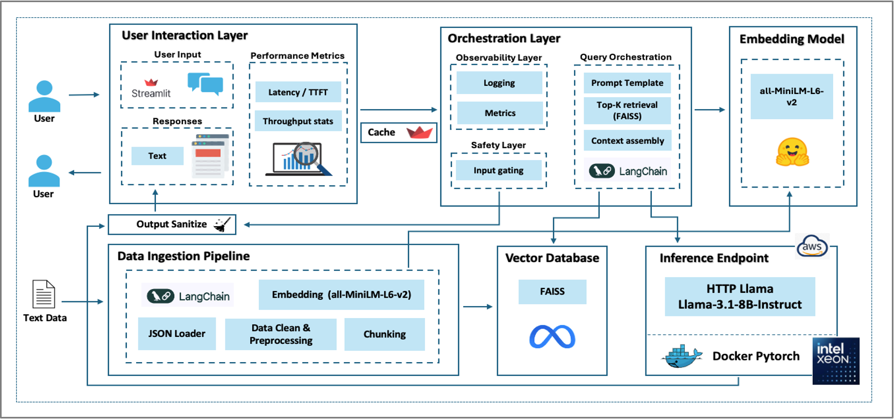
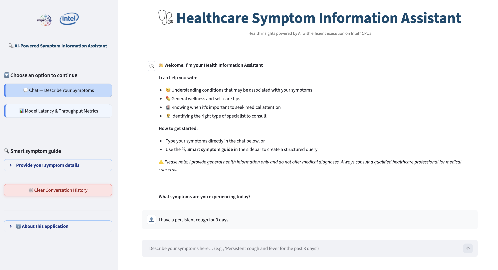
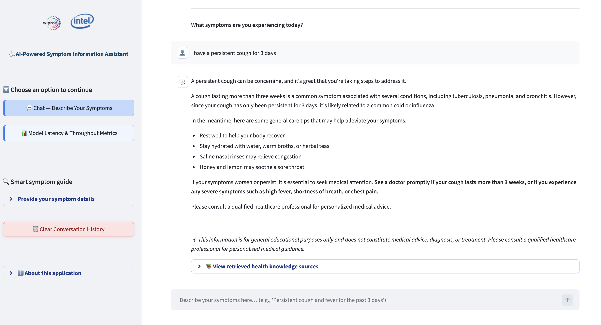

# 🩺 Healthcare Symptom Information Assistant

> **Wipro × Intel Hackathon — April 2026**

A safe, trustworthy, and informative conversational AI system that helps users understand health-related symptoms through a **Retrieval-Augmented Generation (RAG)** pipeline. Built with **Streamlit**, powered by configurable LLM backends (AWS SageMaker or Llama HTTP endpoints), and grounded in a curated healthcare knowledge base.

> ⚕️ **Medical Disclaimer:** This assistant provides **general health information only** and explicitly avoids diagnosis, prescription, or personalized medical advice. Always consult a qualified healthcare professional for medical guidance. Sources: WHO, CDC.

---

## 🎯 Key Features

| Feature | Detail |
|---------|--------|
| **Conversational Chat** | Multi-turn chat UI with persistent session history; last 4 turns injected into each query via `_build_history_aware_query()` so follow-up questions (e.g. *"what about the treatment?"*) resolve correctly without re-stating context |
| **RAG-Powered Responses** | All answers grounded in a curated knowledge base of symptoms, conditions, and preventive tips; retrieves top-K chunks via FAISS similarity search and feeds them into a `RetrievalQA` chain |
| **Semantic Search** | FAISS vector store + local `all-MiniLM-L6-v2` embeddings (384-dim, L2-normalized); CPU-only, no GPU required; index built once on first run and persisted to disk for fast subsequent starts |
| **Smart Symptom Guide** | Sidebar form to build structured queries from symptom (dynamic dropdown from knowledge base), duration, severity (1–10 slider), and additional symptoms; composes a natural-language query and auto-submits to chat |
| **Greeting Handling** | Regex fast-path (`is_simple_greeting`) intercepts bare greetings and social phrases before any safety gate, retrieval, or LLM call; replies with a randomly chosen warm response from a 10-reply pool — no latency cost |
| **Off-Domain Query Handling** | Three-mode domain gate (`keyword` / `semantic` / `hybrid`) blocks non-health queries before the RAG pipeline; semantic mode uses FAISS similarity scoring against the health knowledge base with configurable threshold and optional keyword fallback; blocked queries receive a clear, example-rich redirection message |
| **Safety-First Grounded Prompt** | 24-rule system prompt enforces grounding in retrieved context only, prohibits diagnosis/prescription, mandates cautious phrasing (*"may be associated with"*), requires urgent-care callouts for severe symptoms, and bars all references to the RAG process or conversation history from responses |
| **Response Softening** | Post-generation regex sanitizer replaces hard diagnostic phrases (e.g. *"You have X"* → *"This may be associated with X"*) with cautious language; every response is appended with a mandatory ⚕️ medical disclaimer regardless of content |
| **Flexible LLM Backend** | AWS SageMaker (TGI via boto3 + SSO) or Llama HTTP (OpenAI-compatible `/v1/chat/completions`); switched via `LLM_MODE` env var; both wrapped in a LangChain-compatible `EndpointLLM` adapter |
| **Startup Resource Caching** | LLM client, FAISS vector store, and RAG chain are each loaded once via `@st.cache_resource` and reused for the process lifetime — eliminating per-request initialization overhead |
| **Concurrent Request Tracking** | `st.session_state.active_requests` counter incremented/decremented per request; value captured at submission time and stored in metrics as `concurrent_users` for load correlation analysis |
| **Performance Monitoring** | Per-request TTFT, total/retrieval/end-to-end latency (ms), tokens/sec, context size, output tokens, concurrent users, and error — persisted to `performance_metrics.json` after every request |
| **Metrics Dashboard** | Chart-first in-app dashboard with 6 interactive Altair visualizations (latency trends, distribution, health composition donut, throughput, context/output tokens, concurrency); IST-formatted request table with SR No., CSV export, and reset |
| **Transparent Source Attribution** | Retrieved context documents shown in collapsible expanders next to each response; toggled via `SHOW_RETRIEVED_SOURCES` env var; each source labelled with symptom/condition/category metadata |
| **CSS Design System** | Centralized CSS variable-based theme in `styles.py` — covers metric cards, expanders, sidebar width, active/hover navigation states, blue/red button variants, and page titles; injected once via `StreamlitStyles.apply_all_styles()` |
| **Production-Ready Architecture** | Modular package structure, centralized `AppConfig` dataclass, ANSI-colored structured logging with per-level emojis, thread-safe metrics writes, `app_launcher.py` root entry point, and `scripts/sanity/` startup verification scripts |

---

## ⚡ Quick Start

Request routing in the app follows: greeting fast-path, health-domain gate, and retrieval-grounded response generation for in-domain health queries.

```bash
# 1. Clone
git clone https://github.com/naveensiwas/wipro-intel-genai-hackathon.git
cd wipro-intel-genai-hackathon

# 2. Install dependencies
python3 -m venv venv && source venv/bin/activate
pip install -r requirements.txt

# 3. Download embedding model
mkdir -p assets/models
python -c "
from huggingface_hub import snapshot_download
snapshot_download(
    repo_id='sentence-transformers/all-MiniLM-L6-v2',
    local_dir='assets/models/all-MiniLM-L6-v2',
    local_dir_use_symlinks=False
)
"

# 4. Run (uses SageMaker by default)
python app_launcher.py
```

> For full setup details, environment variable overrides, and Llama HTTP configuration → [Setup Guide](docs/SETUP.md)

---

## 🖼️ Screenshots

### 🏗️ Architecture Diagram


---

### 💬 Chat Interface

|                                                                                                                         |                                                               |
|:-----------------------------------------------------------------------------------------------------------------------:|:-------------------------------------------------------------:|
|                                                               |     |
|                                            Chat-screen with welcome message                                             |            Chat screen with user question response            |
| Smart Symptom Guide in sidebar with structured query form | Chat screen showing retrieved sources (expanders) |

---

### 📊 Metrics Dashboard

|                                                                                |                                                                  |
|:------------------------------------------------------------------------------:|:----------------------------------------------------------------:|
|                |  |
| Health status and controls to download and reset the recent user conversations |       Latency trends, distribution and health composition        |

|                                                                  |                                                                  |
|:----------------------------------------------------------------:|:----------------------------------------------------------------:|
|  |  |
| Throughput, context vs output token charts and concurrency trend |                 User recent conversation history                 |

---

## 📁 Project Structure

```
Wipro_Intel_Hackathon_LLM_EP/
├── app_launcher.py              # Root entry point — sets PYTHONPATH, runs Streamlit
├── requirements.txt             # Pinned Python dependencies
├── pyproject.toml               # Build system (setuptools); package root = src/
├── README.md                    # This file — project overview, quick start, documentation links
│
├── docs/                        # 📚 Detailed documentation
│   ├── ARCHITECTURE.md          # System diagrams & data flow
│   ├── MODULES.md               # Per-module documentation
│   ├── SETUP.md                 # Installation & run instructions
│   ├── CONFIGURATION.md         # All environment variables
│   ├── MONITORING.md            # Metrics schema & dashboard
│   ├── DEVELOPMENT.md           # Customization, troubleshooting & FAQ
│   └── screenshots/             # UI screenshots (chat interface & metrics dashboard)
│
├── src/
│   └── app/
│       ├── main.py              # Streamlit app entry point
│       ├── config/              # AppConfig dataclass + UIText
│       ├── core/                # Logging, metrics, error handling
│       ├── llm/                 # LLM clients, adapter, prompt templates
│       ├── rag/                 # Data loader, embedder, vector store, retriever
│       ├── safety/              # Domain gate + output sanitizer
│       └── ui/                  # Chat, sidebar, dashboard, styles
│
├── data/
│   ├── seed/                    # Healthcare knowledge base (JSON)
│   └── runtime/                 # FAISS index + metrics (auto-generated)
│
├── assets/
│   ├── images/                  # Wipro & Intel logos
│   └── models/
│       └── all-MiniLM-L6-v2/   # Local embedding model (download required)
│
└── scripts/
    └── sanity/                  # Startup verification scripts
```

---

## 📚 Documentation

| Document | Description |
|----------|-------------|
| [🏗️ Architecture](docs/ARCHITECTURE.md) | System diagrams, request data flow, RAG indexing pipeline, safety layers |
| [📋 Module Breakdown](docs/MODULES.md) | Detailed per-module documentation (UI, RAG, LLM, Safety, Core, Config) |
| [🛠️ Setup & Installation](docs/SETUP.md) | Clone, install, download embedding model, configure, run |
| [🔧 Configuration Reference](docs/CONFIGURATION.md) | All environment variables with defaults, types, and descriptions |
| [📊 Performance Monitoring](docs/MONITORING.md) | Metrics schema, field reference, dashboard panels, thread safety |
| [🧑‍💻 Development & FAQ](docs/DEVELOPMENT.md) | Customization, troubleshooting, dependencies, FAQ |

---

## 📝 Attribution

**Project:** Healthcare Symptom Information Assistant  
**Event:** Wipro × Intel Hackathon — April 2026  
**Tech:** Streamlit · LangChain · FAISS · all-MiniLM-L6-v2 · Meta Llama 3.1 8B · Intel® CPU  
**Created by:** The Care Coders Team

---

*Built with ❤️ for safe, trustworthy healthcare information delivery — optimized for Intel® CPU inference.*
