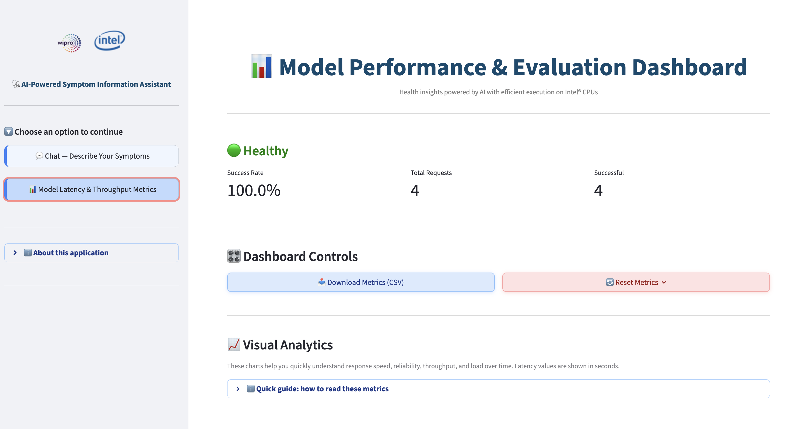
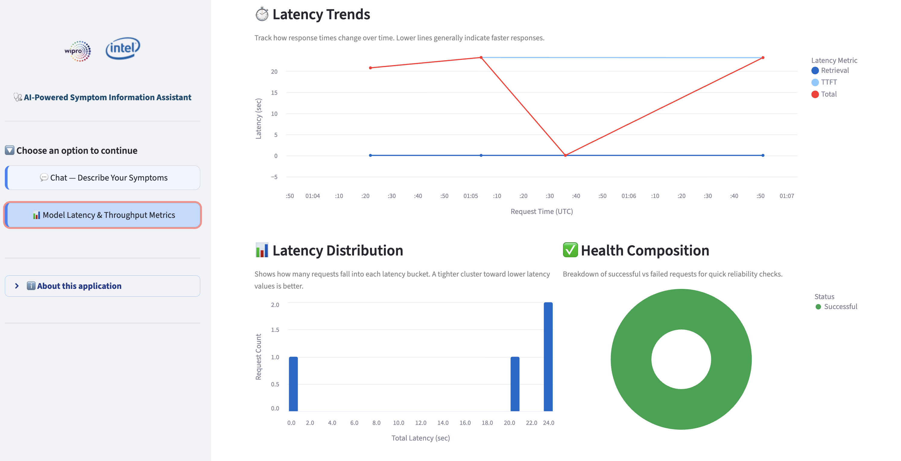
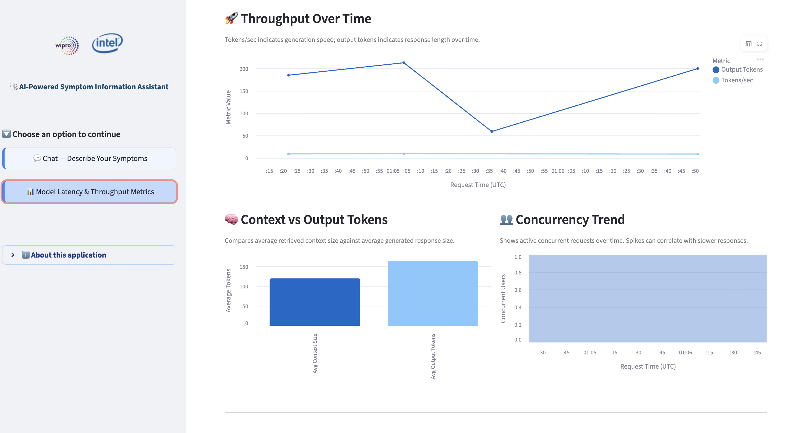
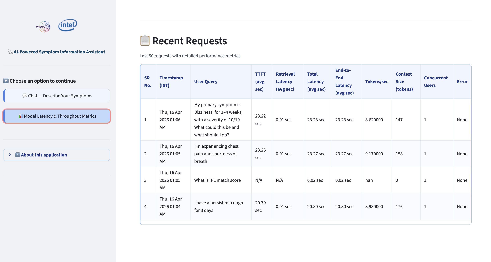

# 📊 Performance Monitoring

> [← Back to README](../README.md)

---

## Metrics Schema

All per-request metrics are stored in `data/runtime/metrics/performance_metrics.json`:

```json
{
  "requests": [
    {
      "timestamp_utc": "2026-04-08T10:32:45Z",
      "query_preview": "I have a persistent cough and fever...",
      "ttft_ms": 234.56,
      "total_latency_ms": 2456.78,
      "end_to_end_latency_ms": 2456.78,
      "tokens_per_sec": 12.34,
      "retrieval_latency_ms": 123.45,
      "context_size_tokens": 450,
      "output_tokens": 234,
      "concurrent_users": 1,
      "error": null
    }
  ],
  "summary": {
    "total_requests": 42,
    "successful_requests": 41,
    "avg_total_latency_ms": 1234.56,
    "max_concurrent_users_observed": 3,
    "last_updated_utc": "2026-04-08T10:32:45Z"
  }
}
```

---

## Metrics Field Reference

| Field | Unit | Description |
|-------|------|-------------|
| `timestamp_utc` | ISO-8601 | UTC request completion time (displayed as IST in dashboard) |
| `query_preview` | String | First 120 chars of user query |
| `ttft_ms` | ms | Time To First Token (approximated as generation end for non-streaming) |
| `total_latency_ms` | ms | Wall-clock time from user input to response ready |
| `end_to_end_latency_ms` | ms | Alias for `total_latency_ms` |
| `tokens_per_sec` | float | Output tokens ÷ generation duration |
| `retrieval_latency_ms` | ms | Duration of FAISS similarity search only |
| `context_size_tokens` | count | Approx. tokens in all retrieved source chunks (word-split) |
| `output_tokens` | count | Approx. tokens in generated response (word-split) |
| `concurrent_users` | count | Active in-flight requests at submission time |
| `error` | string\|null | Exception message if request failed; null otherwise |

> **Token approximation note:** Token counts use `len(text.split())` (whitespace splitting) to avoid loading a heavyweight tokenizer per request. Accuracy is ~85-90% vs. sub-word tokenization.

---

## Rolling Summary Fields

Updated after every request in the `"summary"` block:

| Field | Description |
|-------|-------------|
| `total_requests` | Count of all requests (successful + failed) |
| `successful_requests` | Count of requests with no recorded error |
| `avg_total_latency_ms` | Mean `total_latency_ms` across successful requests |
| `max_concurrent_users_observed` | Highest `concurrent_users` value seen |
| `last_updated_utc` | Timestamp of most recent metrics write |

---

## Metrics Dashboard Panels

Access the dashboard via **📊 Model Latency & Throughput Metrics** in the sidebar.

The dashboard follows a **chart-first layout**: visual analytics are rendered above the requests table so key trends are immediately visible.

### Top-Level Summary

| Element | Description |
|---------|-------------|
| **Health Status Indicator** | 🟢 Healthy (≥80% success rate) / 🟡 Degraded (≥60%) / 🔴 Unhealthy (<60%) |
| **Success Rate** | Percentage of requests completed without error |
| **Total Requests** | Count of all recorded requests |
| **Successful** | Count of error-free requests |

### 🎛️ Dashboard Controls

| Control | Description |
|---------|-------------|
| **Download CSV** | Exports all recorded requests to `performance_metrics_requests.csv` (raw ms values) |
| **Reset Metrics** | Popover with checkbox confirmation; overwrites metrics file with an empty default payload |

---

## 📈 Visual Analytics

Six Altair-based charts grouped under the **Visual Analytics** section. A collapsible **Quick guide** expander is shown above the charts explaining each metric category.

### Quick Guide (collapsible expander)

| Category | Metrics Covered |
|----------|----------------|
| **⚡ Speed Metrics** | TTFT, Total Latency, Retrieval Latency — lower is better |
| **📈 Quality & Load** | Tokens/sec (higher is better), Success Rate, Concurrent Users |

> **Tip shown in guide:** If concurrency spikes and total latency rises together, the system is likely under higher load.

### Chart Reference

| Chart | Type | Description |
|-------|------|-------------|
| **⏱️ Latency Trends** | Multi-series line (interactive) | Plots TTFT, Retrieval, and Total latency in seconds over request time. Each series is color-coded; points are shown for individual requests. |
| **📊 Latency Distribution** | Histogram (bar) | Buckets total latency (sec) across all successful requests. Uses `maxbins=24`; shows how many requests fell into each latency range. |
| **✅ Health Composition** | Donut chart | Proportion of Successful vs Failed requests. Green = successful (#16a34a), Red = failed (#dc2626). |
| **🚀 Throughput Over Time** | Multi-series line (interactive) | Plots Tokens/sec and Output Tokens per request over time. Helps identify generation speed trends. |
| **🧠 Context vs Output Tokens** | Bar chart | Average retrieved context size vs average generated response size in tokens. |
| **👥 Concurrency Trend** | Area chart (interactive) | Active concurrent requests over time. Spikes can correlate with higher latency values. |

> All latency values in charts are displayed in **seconds** (converted from stored milliseconds). Time axes use UTC timestamps.


|                                                                                |                                                                  |
|:------------------------------------------------------------------------------:|:----------------------------------------------------------------:|
|                |  |
| Health status and controls to download and reset the recent user conversations |       Latency trends, distribution and health composition        |

|                                                                  |                                                                  |
|:----------------------------------------------------------------:|:----------------------------------------------------------------:|
|  |  |
| Throughput, context vs output token charts and concurrency trend |                 User recent conversation history                 |

---

## 📋 Recent Requests Table

Displayed below the Visual Analytics section.

| Property | Detail |
|----------|--------|
| **Rows shown** | Last 50 requests, sorted descending by timestamp |
| **Timestamps** | UTC → IST (`Asia/Kolkata`), formatted as `Ddd, DD Mon YYYY HH:MM AM/PM` |
| **SR No.** | 1-based sequential row number column |
| **Latency columns** | TTFT, Retrieval Latency, Total Latency, End-to-End Latency — all formatted as `X.XX sec` |
| **Styling** | Custom HTML table with blue header (`#1e3a8a` on `#eff6ff`), alternating row stripes, horizontal scroll for wide tables |

**Columns displayed:**

| Column | Source Field | Notes |
|--------|-------------|-------|
| SR No. | — | Row number (1-based) |
| Timestamp (IST) | `timestamp_utc` | Converted UTC → IST |
| User Query | `query_preview` | First 120 chars of query |
| TTFT (avg sec) | `ttft_ms` | Formatted in seconds |
| Retrieval Latency (avg sec) | `retrieval_latency_ms` | Formatted in seconds |
| Total Latency (avg sec) | `total_latency_ms` | Formatted in seconds |
| End-to-End Latency (avg sec) | `end_to_end_latency_ms` | Formatted in seconds |
| Tokens/sec | `tokens_per_sec` | Raw float |
| Context Size (tokens) | `context_size_tokens` | Approx. word count |
| Concurrent Users | `concurrent_users` | Active requests at submission |
| Error | `error` | Exception message or blank |

---

## Thread Safety

All writes to the metrics JSON file are protected by a module-level `threading.Lock` (`_METRICS_LOCK`).  
This is safe for concurrent requests from multiple Streamlit sessions.

---

## Reset Metrics

From the dashboard:
1. Click **🔄 Reset Metrics** (popover button)
2. Check the confirmation checkbox
3. Click **🔴 Confirm Reset**

This overwrites the metrics file with an empty default payload.

---

*[← Back to README](../README.md)*
